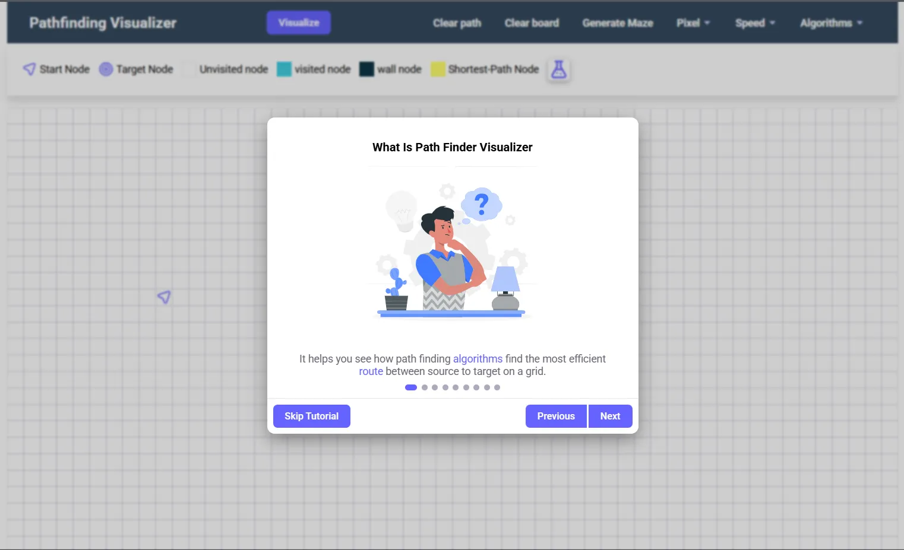
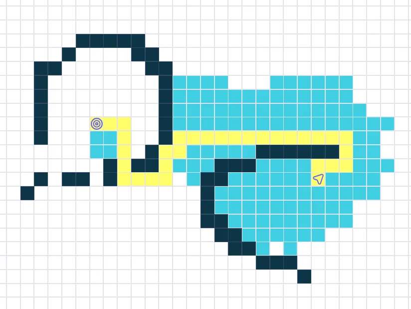
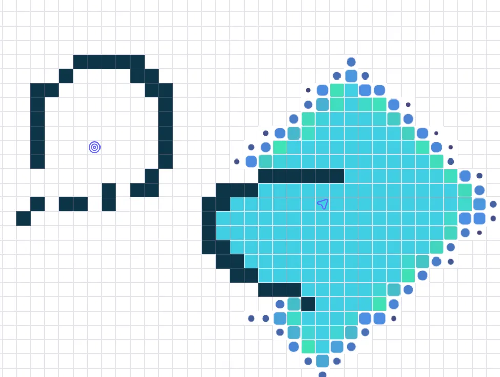
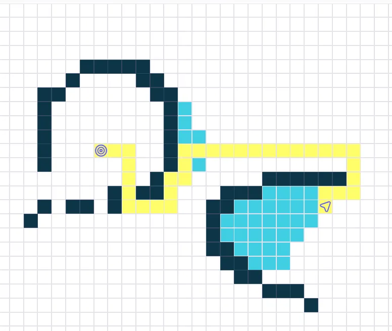
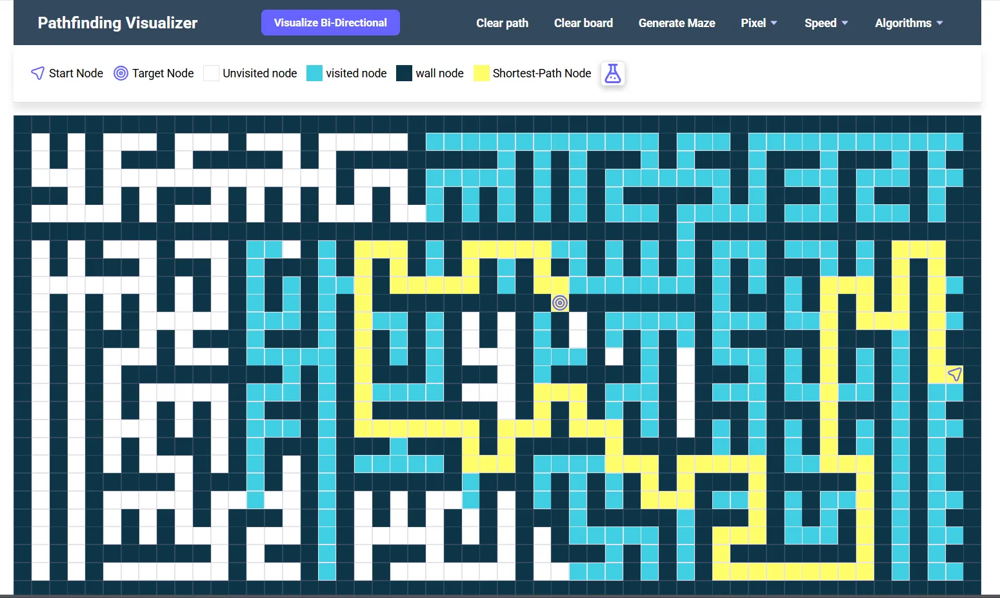

# AlgoNavigator
Built an interactive graph traversal visualizer for real-time exploration of pathfinding algorithms
---

## ✨ Key Features

- **Interactive Grid Editor**
  - Paint walls with click-and-drag
  - Movable start/end points
  - Random maze generation
  - Dynamic weight adjustment (for weighted algorithms)

- **Multiple Algorithms**
  - Dijkstra's Algorithm (weighted)
  - A* Search (with heuristic visualization)
  - Breadth-First Search (BFS)
  - Depth-First Search (DFS)
  - Bi-directional BFS (new!)
  - Greedy Best-First Search

- **Learning Tools**
  - Step-by-step algorithm animation
  - Speed control (slow-mo to fast-forward)
  - Node inspection during visualization
  - Path cost display
  - Tutorial mode (new!)

---

## 🖥️ Screenshots Gallery

|  |  |
|----------------------------------------------------|-------------------------------------------------|
| *Interactive Tutorial Mode*                        | *A* Algorithm Visualization*                   |

|  |  |
|-----------------------------------------------------------|------------------------------------------------------|
| *Dijkstra's Algorithm in Action*                          | *Greedy Best-First Search*                          |

|  |
|---------------------------------------------------|
| *Random Maze Generation Feature*                  |

---

## 🚀 Quick Start

### Option 1: Local Installation
```bash
git clone https://github.com/gaganreddym/AlgoNavigator.git
cd AlgoNavigator
# Open index.html in your browser
